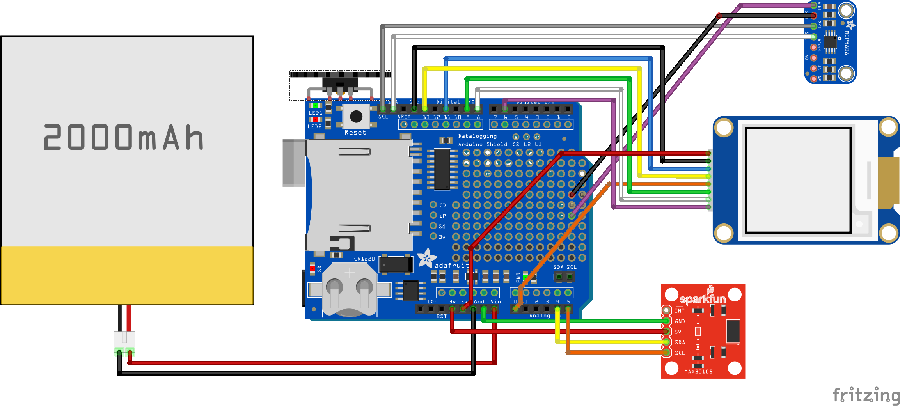

# menopause-ring

Measure heart rate and skin temperature to track hot flush occurence and severity. This prototype uses a nifty e-paper display to show realtime data and sd card logging for later analysis.

## Getting Started

The code will work with the Arduino IDE, but it is easier with PlatformIO, which is cross-platform and free. See instructions below.

### Prerequisites

#### Hardware
* Arduino Uno
* [Wave Shield](https://www.adafruit.com/product/94), or any SD card shield ([example](https://www.adafruit.com/product/1141))
* [MAX3010x Heart Rate Sensor Breakout](http://sfe.io/p14045) (x = 2 or 5)
* [MCP9808 Temperature Sensor Breakout](https://www.adafruit.com/product/1782)
* [1.54" Waveshare e-Paper Display Module](https://www.waveshare.com/wiki/1.54inch_e-Paper_Module)
* Toggle switch (optional)
* 2000 mAh 3.7V LiPo Battery (optional)


If you use another shield and don't have a switch, just connect a hookup wire from pin 7 to ground to keep the code running.

#### Software
* PlatformIO (preferred) or
* Arduino IDE

#### Libraries
* [SparkFun MAX3010x Pulse and Proximity Library](https://github.com/sparkfun/SparkFun_MAX3010x_Sensor_Library)
* [Adafruit MCP9808 Library](https://github.com/adafruit/Adafruit_MCP9808_Library)
* [PetitFS](https://github.com/greiman/PetitFS) (by Bill Greiman)
* [e-Paper](https://github.com/waveshare/e-Paper) (by “Yehui from Waveshare”)
(The e-Paper library has been modified to reduce RAM by displaying only numerical digits. The modified code is placed in the src/ folder.. no need to download separately.)

### Installing

#### PlatformIO

After connecting sensor/display pins to your device, build and upload:
```
pio run
```

If you run into any issues, you can use the debug flag to watch the serial port for errors.
```
build_flags = -D DEBUG
```
(Keep in mind that this will disable sd logging due to limited RAM on the Arduino Uno.)

There are other debug flags to turn off individual sensors for further debugging.

#### Arduino IDE

If using the Arduino IDE instead of PlatformIO, you can manually add the PetitFS library to your code by dumping the files into the same folder as the .ino file. The sensor libraries can be installed via the Library Manager.

## Running the tests

If you are interested in running this prototype on another system, you might want to run the embedded tests in the /test directory using PlatformIO. Most of these tests are for validating PPG signal processing and beat detection.